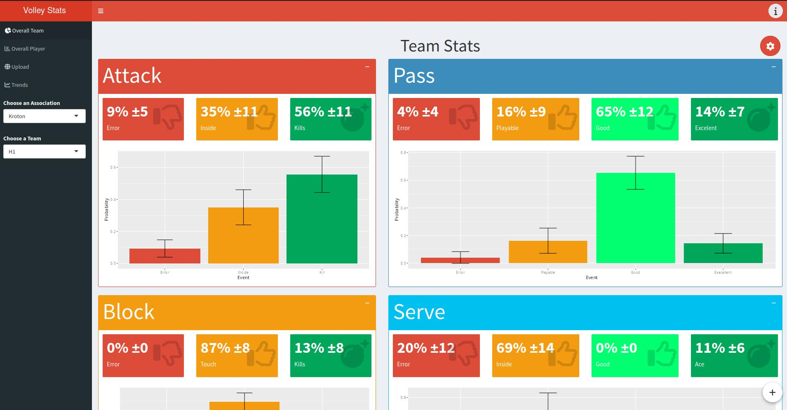

<h1 align="center">Welcome to Volley Stats 🏐</h1>

  
  

## Purpose

VolleyStats is a Shiny web application designed for volleyball teams and coaches to track and analyze player and team performance. 
It provides a user-friendly interface to upload game data, visualize key statistics, and identify trends over time. 

## Features 
This application is designed to empower users to:

- **Player and Team Statistics:**
    - Calculate and display key performance metrics for individual players and the entire team.
    - Metrics include attack efficiency, serve reception quality, blocking effectiveness, and serving accuracy.
- **Interactive Visualizations:**
    - Visualize data through interactive plots and charts, such as bar graphs and violin plots.
    - Gain a clear understanding of performance distributions and identify areas for improvement.
- **Trend Analysis:**
    - Track performance trends over multiple games using line graphs and regression models.
    - Monitor player and team progress and make informed decisions based on historical data.
- **Data Upload and Management:**
    - Easily upload game data using CSV files.
    - Download CSV templates to ensure data consistency.
    - Create and manage team rosters and player information.
- **Secure User Authentication:**
    - Securely authenticate users with username and password protection.
    - Restrict data access and modification based on user roles (admin vs. regular user).

## Technologies Used

- **R:** The website is built using the R programming language, leveraging its powerful statistical computing and data visualization capabilities.
- **Shiny:** The Shiny framework provides the interactive web application framework for the website.
- **Shiny Dashboard:** The Shinydashboard package is used to create the website's dashboard layout and components.
- **RMariaDB:** The RMariaDB package provides the interface to interact with the MariaDB database.
- **shinymanager:** Enables secure user authentication and authorization.
- **Other R Packages:** The website utilizes various other R packages for data manipulation, visualization, and user interface design, including tidyverse, data.table, shinyWidgets, and more.

## Installation

## Code Structure

The repository's code is modularized for maintainability and clarity:

- **`ui.R`:**  Defines the application's user interface, including layout, inputs, and outputs.
- **`server.R`:** Contains the server-side logic, handling data processing, calculations, and rendering visualizations.
- **`global.R`:**  Houses global variables, functions, and database connection settings.
- **`modules/`:** This directory contains individual modules for different functionalities, promoting code reusability and organization. 
- **`db_driver/`:**  Manages interactions with the database, including table creation, data insertion, and querying.

## Author

👤 **Massimiliano Falzari**

* Website: [personal website](https://vimmoos.github.io/)
* Github: [@vimmoos](https://github.com/vimmoos)

## Show your support

Give a ⭐️ if this project helped you!

***
_This README was generated with ❤️ by [readme-md-generator](https://github.com/kefranabg/readme-md-generator)_
